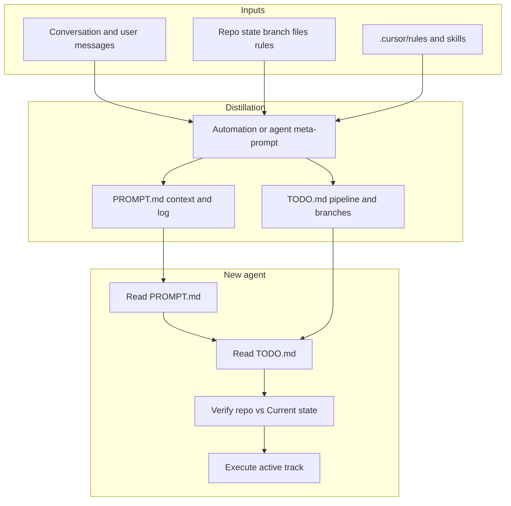

# Conversation handoff via `PROMPT.md` + `TODO.md`

## Is this a good plan?

**Yes**, with three refinements:

1. **Distill, do not archive** — `PROMPT.md` is not a chat log. A new agent needs *decisions, constraints, current state, and next actions*—not narrative replay. Your [asset-ontology `PROMPT.md`](C:\Users\VLAD\HOME\CODE\team-me\asset-ontology\PROMPT.md) already does this well: stable rules up top, dated **Conversation log** at the bottom (now with **topic tags** per session).

2. **Separate durable vs session deltas** — Keep long-lived project truth in fixed sections; **append** only what changed this session to the log.

3. **Split memory from backlog** — `PROMPT.md` = *what is true and what to do next in the active thread*; `TODO.md` = *structured plans, mind-branches, severity, and time priority* across parallel tracks. Cross-link them; do not duplicate full plan write-ups in both files.

**Limitation for Automations:** A scheduled automation does not automatically see this chat unless you pass context (paste summary, attach transcript path, or run the automation *inside* the same agent session). Design the trigger as **explicit** (“export handoff”, “before I switch models”) and feed conversation context or user notes.



---

## File pair (canonical names)

| File | Role |
|------|------|
| **`PROMPT.md`** | Agent handoff: mission, constraints, user inputs, decisions, **current state**, immediate next actions, references, **tagged conversation log** |
| **`TODO.md`** | Backlog: structured **plans**, **mind-branches** (exploratory paths in pipeline), **severity**, **time priority**; links to `PROMPT.md` sections when a track is active |

**Convention:** Always **`PROMPT.md`** (capitals) at repo root for new work. Legacy lowercase `prompt.md` in existing repos may be renamed when you next touch that repo (optional migration note in log).

**Do not** put full multi-step plan specs in `PROMPT.md` section 6 if they belong in `TODO.md`—use “Active track: see TODO.md → `plan-id`”.

---

## Hierarchical template for `PROMPT.md`

Structure top-down: a new agent reads through section 6, then skims the log for recent context.

```markdown
# PROMPT.md — agent handoff

## 0. Meta
- Purpose: (one sentence)
- Audience: coding agent / reviewer
- Last updated: YYYY-MM-DD
- Active track: (TODO.md plan-id or "none")
- Companion: [TODO.md](./TODO.md)

## 1. Mission
What we are building or fixing; definition of done.

## 2. Hard constraints (must not violate)
Numbered list: user rules, legal/safety, architecture invariants, “do not implement until asked”.

## 3. User inputs (verbatim where it matters)
Short quotes or bullet paraphrases of **your** requirements—not the agent’s interpretation.
Tag each: [binding] vs [preference].

## 4. Decisions made
| ID | Decision | Why | Alternatives rejected |
|----|----------|-----|------------------------|
| D1 | ... | ... | ... |

Mark **superseded** decisions with date (do not delete).

## 5. Current state
- Branch / commit (if git)
- Files touched (paths only)
- What works / what is broken
- Commands run that matter (exit status if relevant)
- Open questions for the user

## 6. Next actions (ordered, near-term only)
1. ...
2. ...
(For multi-track backlog → TODO.md)

## 7. References
Links to authoritative docs, schemas, tickets—not chat.
Pointers to `.cursor/rules`, skills, `AGENTS.md` (do not duplicate full rule text).

## 8. Anti-goals / out of scope
What we explicitly are NOT doing.

## 9. Conversation log (append-only, tagged)

Column guide:
- **Topics** — 2–6 lowercase kebab tags (e.g. `ontology`, `validator`, `handoff-export`)
- **Session** — short human label for the chat/thread (e.g. `cursor-plan-handoff`, `slack-emo-debug`)
- **Summary** — distilled outcomes only (1–3 sentences)

| Date | Topics | Session | Summary |
|------|--------|---------|---------|
| 2026-06-02 | `agent-handoff`, `automation` | `plan-prompt-todo` | Adopted PROMPT.md + TODO.md split; log tagging spec. |

Optional extra columns when useful:
- **Refs** — `TODO#plan-3`, `D4`, PR/issue URL
- **Status** — `active` \| `parked` \| `done` (for the session row only)
```

**Tagging rules:**

- **Topics** = stable vocabulary across the repo (reuse tags; avoid one-off synonyms).
- **Session** = identifies *which conversation* produced the row (not the same as topic).
- One log row per handoff export or meaningful milestone—not per message.
- When a session spans multiple topics, list all relevant topic tags on one row.

**Size budget:** Aim for **< 400 lines** in `PROMPT.md`; roll older log rows into `### Historical log summary` under section 9.

---

## Template for `TODO.md`

Structured pipeline of plans and exploratory **mind-branches**. Items move between sections as status changes.

```markdown
# TODO.md — plans and pipeline

## 0. Meta
- Last updated: YYYY-MM-DD
- Context: [PROMPT.md](./PROMPT.md)
- Legend: see below

## Legend

### Severity
| Tag | Meaning |
|-----|---------|
| **must-have** | Required for current milestone / blocking |
| **nice-to-have** | Valuable but deferrable without breaking milestone |

### Time priority
| Tag | Meaning |
|-----|---------|
| **now** | Do in current session or before next handoff |
| **next** | Immediately after active track |
| **soon** | This week / current sprint |
| **later** | No fixed date; backlog |
| **by:YYYY-MM-DD** | Hard target (use explicit date when known) |

### Status
`idea` → `mind-branch` → `planned` → `in-progress` → `blocked` → `done` → `dropped`

- **mind-branch** — exploratory path; may merge into a plan or be dropped without guilt.

---

## Active track
(At most one primary plan should be "in-progress" unless user explicitly parallelizes.)

| ID | Title | Severity | Time | Status | Notes |
|----|-------|----------|------|--------|-------|
| plan-1 | ... | must-have | now | in-progress | Link: PROMPT §6 |

---

## Pipeline (committed plans)

| ID | Title | Severity | Time | Status | Depends | PROMPT topics |
|----|-------|----------|------|--------|---------|---------------|
| plan-2 | ... | must-have | soon | planned | plan-1 | `validator` |

---

## Mind-branches (exploratory, in pipeline)

Ideas worth tracking but not yet a committed plan.

| ID | Title | Severity | Time | Status | Parent / related | Hypothesis |
|----|-------|----------|------|--------|------------------|------------|
| branch-a | ... | nice-to-have | later | mind-branch | plan-2 | If X then try Y |

---

## Done / dropped (archive)

| ID | Title | Closed | Outcome |
|----|-------|--------|---------|
| plan-0 | ... | 2026-05-28 | shipped |

---

## Session index (optional cross-ref to PROMPT log)

| Session label | Date | TODO IDs touched | PROMPT log row |
|---------------|------|------------------|----------------|
| plan-prompt-todo | 2026-06-02 | plan-1 | 2026-06-02 row |
```

**Sync rules between files:**

- New **binding** user requirement → `PROMPT.md` §3 (and bump log).
- New **plan** or **mind-branch** → `TODO.md` table row; reference from `PROMPT.md` §0 Active track + log **Refs**.
- **Next actions** in `PROMPT.md` §6 = steps for the **active track only**; other work stays in `TODO.md` with severity/time tags.
- Promote `mind-branch` → `planned` when you commit to executing it; demote or `dropped` when abandoned (one line in conversation log).

---

## Distillation rules (for human or automation)

- **Facts over story** — No “we discussed”; only outcomes.
- **User words for requirements** — Preserve nuance in `PROMPT.md` §3.
- **No secrets** — Redact tokens; reference env var names only.
- **No duplicate cursors** — Reference `.cursor/rules` paths, do not copy full text.
- **Testable state** — In `PROMPT.md` §5.
- **Backlog discipline** — Every non-trivial future task gets a `TODO.md` row with **must-have** or **nice-to-have** and a **time** tag.
- **Tag consistency** — `PROMPT.md` log **Topics** should align with `TODO.md` **PROMPT topics** column where applicable.
- **Idempotent merge** — Update `PROMPT.md` §0–8 and `TODO.md` tables in place; **append** log rows only.

---

## Workflow

1. **During work** — “add to PROMPT” / “add to TODO” when you state requirements or new plans.
2. **Before LLM switch** — Run handoff export (updates **both** files).
3. **New agent bootstrap** — `Read PROMPT.md, then TODO.md; confirm §5 Current state matches the repo; work only the Active track unless I say otherwise.`
4. **After milestone** — Move items in `TODO.md` to Done; roll log if needed; refresh `PROMPT.md` §5–6.

---

## Meta-prompt for Cursor Automations

Use as **agent instructions** (adjust trigger/channel in editor).

```text
You maintain two handoff files at the repository root:
- PROMPT.md (create or merge; always this exact capitalized name)
- TODO.md (create or merge)

INPUTS (use all available):
- Full conversation in this run
- User "handoff notes" in the trigger message
- Git branch, status, recent diff summary
- Existing PROMPT.md and TODO.md (merge; do not blindly overwrite)
- .cursor/rules and README — reference only

TASK — PROMPT.md:
1. Distill into sections ## 0. Meta through ## 8. Anti-goals per the template.
2. Section ## 6. Next actions: only the active track (near-term). Point to TODO.md for other work.
3. APPEND one row to ## 9. Conversation log with:
   - Date (YYYY-MM-DD)
   - Topics: 2–6 kebab-case tags
   - Session: short label for this chat (use user-provided session name if given; else derive from main task)
   - Summary: 1–3 sentences of outcomes
   - Optional Refs column: TODO IDs, decision IDs
4. Set ## 0. Meta "Active track" to the current TODO plan-id.
5. Keep under 400 lines; consolidate old log into Historical summary if needed.

TASK — TODO.md:
1. Ensure Legend sections exist (severity, time, status).
2. Update Active track, Pipeline, and Mind-branches tables.
3. Every item MUST have: ID, Title, Severity (must-have | nice-to-have), Time (now | next | soon | later | by:YYYY-MM-DD), Status.
4. New exploratory ideas → Mind-branches with status mind-branch.
5. Promote/demote items when conversation shows commitment or abandonment; move finished items to Done/dropped with date.
6. Align "PROMPT topics" column with tags used in the new conversation log row.
7. Optional: append Session index row linking Session label ↔ TODO IDs ↔ log date.

GENERAL:
- No secrets. No duplicate .cursor/rules text.
- Mark superseded PROMPT decisions; do not delete.
- Output reply: (a) 5-bullet summary, (b) active track + top 3 next actions, (c) open questions, (d) TODO items added/changed (IDs only).

QUALITY BAR:
A new agent with zero chat history can continue using only PROMPT.md, TODO.md, and the repo.
```

**Automation setup (high level):**

- **Trigger:** Manual / keyword (“handoff”, “export PROMPT”).
- **Tools:** Read/write files, git status/diff.
- **Input:** Optional `session: my-label` and `topics: tag1, tag2` in trigger message for consistent tagging.

---

## Relation to existing repos

- [`PROMPT.md`](C:\Users\VLAD\HOME\CODE\team-me\asset-ontology\PROMPT.md) — extend section 9 with **Topics** and **Session** columns; add companion `TODO.md` for parallel ontology tasks.
- [`em-testbench/prompt.md`](C:\Users\VLAD\HOME\CODE\team-me\energy-management\em-testbench\prompt.md) — optional rename to `PROMPT.md` + new `TODO.md` when you next work there.
- [PV placement `prompt.md`](C:\Users\VLAD\České vysoké učení technické v Praze\Team-APOLLON - Dokumenty\PV placement rules\prompt.md) — workflow steps can stay in `PROMPT.md`; backlog steps → `TODO.md`.

For repos with custom `PROMPT.md` headings (e.g. “Project intent”), document heading mapping once in `## 0. Meta`; do not flatten specialized structure.

---

## Optional enhancements (later)

- Cursor user rule: “On ‘handoff’, update PROMPT.md and TODO.md per team template.”
- PR checklist: both files updated when constraints or pipeline change.
- YAML front-matter on either file for tooling (`active_track: plan-1`).

No application code required—only file maintenance via automation or agent.
