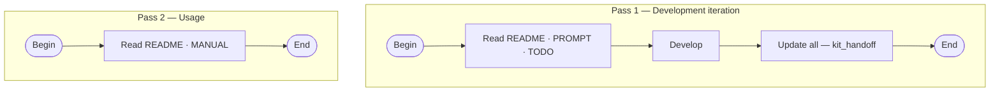

# ai-promptkit

Kit workers for **other** project workspaces. Outputs are written to the project you have open—not into this repo.

**Clone:** `C:\Users\VLAD\HOME\CODE_m4rt1n3k\ai-promptkit` · [github.com/m4rt1n3k/ai-promptkit](https://github.com/m4rt1n3k/ai-promptkit)

## Handoff file ecosystem (PROMPT · TODO · MANUAL)

Each target project keeps **three root files** maintained by kits (templates in [kits/templates/](kits/templates/)):


| File                       | Audience                | Role                                                                                                          |
| -------------------------- | ----------------------- | ------------------------------------------------------------------------------------------------------------- |
| **[PROMPT.md](PROMPT.md)** | Coding agent / reviewer | Distilled mission, constraints, decisions, state, next actions; §9 append-only conversation log (table only). |
| **[TODO.md](TODO.md)**     | Human + agent           | Plans, active track, pipeline; **only tasks the user stated** in chat (`kit_todo`).                           |
| **[MANUAL.md](MANUAL.md)** | Human operators         | How to use and maintain the project—workflows, roles, ops (not agent handoff prose).                          |


**`kit_handoff`** refreshes all three after a session. Individual kits update one file each (see table below).

### Working cycle (two passes)

Use **pass 1** when building or changing the project; **pass 2** when operating it. Both start from this README for context.

#### Pass 1 — Development iteration

| Step | Read / do | Who |
|------|-----------|-----|
| Begin | — | Developer (+ agent) |
| Orient | [README.md](README.md) · [PROMPT.md](PROMPT.md) · [TODO.md](TODO.md) | Developer + agent |
| Develop | Code, design, tests (Cursor Agent as needed) | Developer + agent |
| Update all | `kit_handoff` → refresh PROMPT, TODO, MANUAL | Session owner |
| End | — | — |

#### Pass 2 — Usage

| Step | Read / do | Who |
|------|-----------|-----|
| Begin | — | Operator, user, reviewer |
| Orient | [README.md](README.md) · [MANUAL.md](MANUAL.md) | Human |
| End | Run procedures from MANUAL (no kit required unless docs change) | Human |



Pass 1 may run many times; pass 2 is for day-to-day use without opening PROMPT/TODO unless you switch back to development.

Step-by-step handoff (pass 1) and troubleshooting: [MANUAL.md](MANUAL.md).

## Invoke (Agent chat in your project)

```text
from workspace ai-promptkit run kit_prompt
```

```text
from workspace ai-promptkit run kit_todo
```

```text
from workspace ai-promptkit run kit_handoff
```

```text
from workspace ai-promptkit run kit_manual
```

```text
from workspace ai-promptkit run kit_design
```

The agent reads `kits/<name>.md` from ai-promptkit and updates files at **your workspace root**.

Optional lines in the same message:

```text
session: my-label
topics: tag-one, tag-two
notes: what changed in this chat
```

## Kits


| Command       | File                                       | Writes                              |
| ------------- | ------------------------------------------ | ----------------------------------- |
| `kit_prompt`  | [kits/kit_prompt.md](kits/kit_prompt.md)   | `PROMPT.md`                         |
| `kit_todo`    | [kits/kit_todo.md](kits/kit_todo.md)       | `TODO.md`                           |
| `kit_handoff` | [kits/kit_handoff.md](kits/kit_handoff.md) | `TODO.md`, `PROMPT.md`, `MANUAL.md` |
| `kit_manual`  | [kits/kit_manual.md](kits/kit_manual.md)   | `MANUAL.md`                         |
| `kit_design`  | [kits/kit_design.md](kits/kit_design.md)   | `.cursor/rules/kit-design.mdc`      |


Templates: [kits/templates/](kits/templates/).