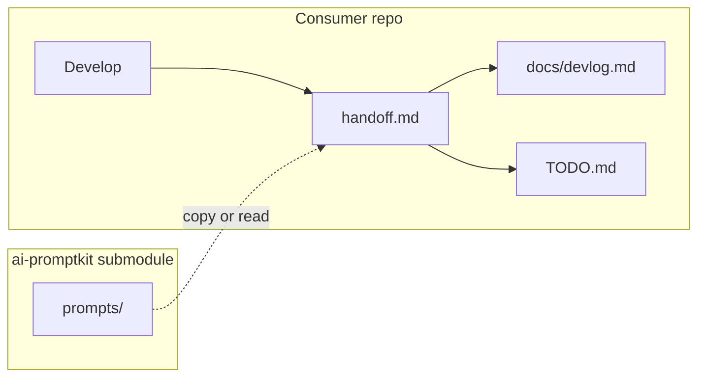

# ai-promptkit

Shared **prompts** and **development culture** for many projects. Add as a git submodule; copy or invoke prompts into each consumer repo.

**Repo:** [github.com/m4rt1n3k/ai-promptkit](https://github.com/m4rt1n3k/ai-promptkit)

## Who reads what

| Reader | Start here |
|--------|------------|
| Human (setup, handoff) | [docs/manual.md](docs/manual.md) |
| Coding agent | [docs/conventions.md](docs/conventions.md) · [TODO.md](TODO.md) |
| Session history | [docs/devlog.md](docs/devlog.md) |
| Prompt catalog | [prompts/README.md](prompts/README.md) |

## Quick start (consumer project)

```bash
git submodule add https://github.com/m4rt1n3k/ai-promptkit vendor/ai-promptkit
cp -r vendor/ai-promptkit/prompts .
```

Bootstrap full `docs/` layout (first time only):

```text
Read vendor/ai-promptkit/prompts/bootstrap-docs-prompts-layout.md and run on this workspace.
```

End of session:

```text
Run prompts/handoff.md — end of session handoff.
```

Details: [prompts/invoke.md](prompts/invoke.md) · [docs/manual.md](docs/manual.md)

## Layout

```text
ai-promptkit/
├── README.md
├── TODO.md
├── docs/                  # This meta-repo's documentation
│   ├── manual.md
│   ├── conventions.md
│   ├── devlog.md
│   └── adr/
├── prompts/               # Portable prompts (the product)
│   ├── handoff.md
│   ├── session-summary.md
│   ├── update-devlog.md
│   └── ...
├── templates/             # Bootstrap seeds
└── tools/build_wiki.py    # Optional wiki generator
```

## Working cycle



## Migrate from legacy kits

If a project used `from workspace ai-promptkit run kit_handoff`:

1. Run bootstrap prompt once.
2. Replace kit phrases with `prompts/handoff.md` (see [ADR-0001](docs/adr/0001-prompts-over-kits.md)).
3. Remove stub `PROMPT.md` / `MANUAL.md` when comfortable.

Legacy `PROMPT.md` and `MANUAL.md` in old consumer repos map to `docs/conventions.md`, `docs/manual.md`, and `docs/devlog.md`.
